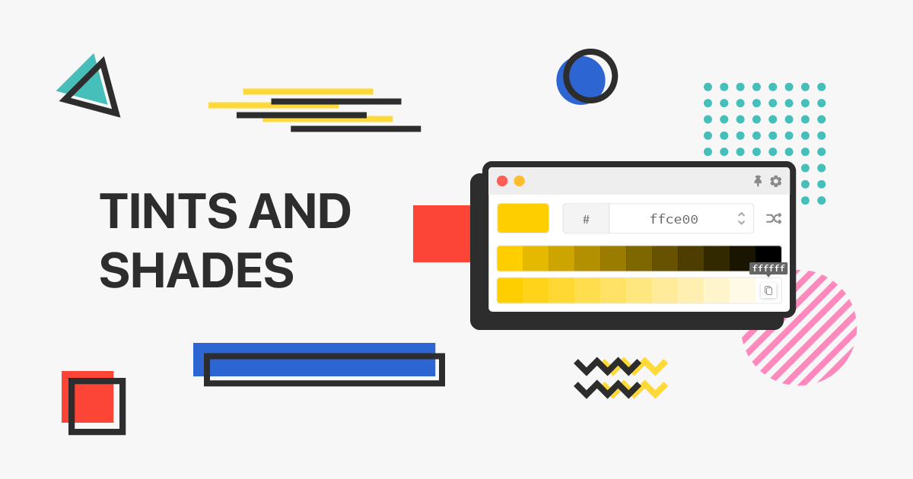

<h1 align="center">Tints and Shades</h1>

    A tints and shades generator built using Electron and LitElement.

    
    
    

## Setup ##
Below shows some basic setup steps.

### Node version ###
This project is developed using Node.js 12. The version is already specified in the `.nvmrc` file. Suggest to run `nvm use` when you enter the project folder.

### Install packages need for the project ###
Install yarn packages in project root folder first using `yarn install`.

### To start the project ##
Run `yarn start` in project root folder.

### To build the app for distribution ###
Run `yarn package`  in the project root folder to create package for macOS, Linux and Windows. All the output files can be found in `./build-packages` folder.

To create package for each individual platforms:
* macOS: `yarn package:mac`
* Linux: `yarn package:linux`
* Windows: `yarn package:windows`

### To run unit tests ###
Run `yarn test` in the project root folder.

### To run linters ###
Run `yarn lint` in the project root folder to start a ESLint checking.  
Run `yarn lint:lit-analyzer` in the project root folder to run Lit Analyzer.

### To run web component analyzer ###
Run `analyze:web` in the project root folder.

### To update change log ###
Run `yarn release` in the project root folder.  
To skip bumping version number on first release, run `yarn first-release` in the project root folder

## To update alias ##
To add or modify any existing alias, please modify all the files listed below:
1. `.eslintrc`
2. `tsconfig.json`
3. `webpack/webpack.base.conf.js`
